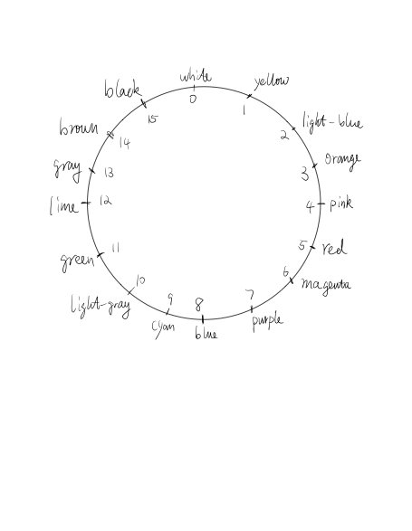

# Evolution Mod
This is a mod for the Java version of Minecraft. It enables the evolution of Minecraft sheep via natual selection using an evolutionary algorithm.
To accomplish this evolution, we modified the color, reproduction, and life cycle of sheep, as well as the hunting behavior of wolves.

(TODO: include a screenshot of a population of sheep and wolves after a bit of evolution)

## Using the Mod
Information about how to just download and use the mod will be here
(TODO: have a guide just for people that want to use the mod, not edit it, and try to make that as easy as possible)

## Evolutionary Algorithm

For this project, we want the color of the sheep's wool to impact predation by wolves, selecting for sheep that match their environment better and demonstrating natural selection. 
This mod implements all required components of evolution via natural selection, leading to actual evolutionary dynamics.

### Variation
(TODO: Explain how variation is achieved in the mod; should discuss both how the mutations are introduced and how the existing mixing of parent colors is used)

### Inheritance
(TODO: Explain how sheep now reproduce after eating enough grass and make an offspring that is likely to be similar in color

### Competition
(TODO: Explain how wolves are more likely to target and kill sheep that stand out from their surroundings, leading to differential survival of sheep based on their wool color)

## Editing the Mod
To edit the mod (and run currently), you need IntelliJ.
You can download IntelliJ Idea using this link: https://www.jetbrains.com/idea/download/#section=mac, or just search Intellij Download on Google.
(The community version is enough for this project). Please choose the right operating system (i.e. I'm using macOS m1 chip, then I would choose macOS below the "Download IntelliJ IDEA" and under community, choose .dmg(Apple Silicon) and then click download).

Then, run the build.gradle file.

After that, in the upper right corner, click gradle, and in fabric dropdown menu, click runClient.
 

### Tips
1. Register your mixin at eliarbogast.evolution.mod.mixins after creating it
(TODO: What does 'register' mean and how do you do it?)

2. Use abstract class when creating a mixin.
(TODO: what does this mean?)

3. When you want to use `Inject` to modify a function in the original class, if the function is a void type, you can pass in `CallbackInfo` as the parameter (ex: `EscapeFromWolfMixin`),
otherwise, please pass in `CallbackInfoReturnable<--RETURN TYPE-->` as a parameter (ex: `AttackSheepAndBreedMixin`).
(TODO: include screenshots)

## Q&A

### Mixins
This mod uses Mixins to accomplish it's changes.
If you are new to Mixins, this is a helpful place to start: https://fabricmc.net/wiki/tutorial:mixin_introduction

### SheepLifeCycleMixin
The `SheepLifeCycleMixin` class has the functions:

1. detects the color of the surrounding blocks for a given sheep 

2. calculates the difference between the color of the 
sheep and the surrounding color,

3. kills the sheep based on this difference.
(TODO: isn't this no longer true since it relies on the wolves to kill the sheep now?)

### DyeUtils
To quantify the difference between a sheep's wool color and the surrounding environment, we created a color ring, defined in `DyeUtils`, as shown below:

(more detail about it please check the code comments.)

### attackSheepGoal
(TODO: Expand on this to explain the goal of this change and how it works)
Then, by modifying the meleeAttackGoal in wolf Class, I created the attackSheepGoal. Inside this goal, I modified the attack() function in meleeAttackGoal to kill the sheep by the difference. 
The attack() will detect if the target is a sheep, then kill the sheep by chance based on the difference between the surrounding color and color of sheep. What's more, if the wolf failed to attack the sheep more than 10 times, it will be dead
(more details see the comments of the code).

### GrassReproduceMixin
Moreover, in order to simulate the "mutate" process in the natural world, we created GrassReproduceMixin and SheepColorMixin, which let sheep reproduce little sheep after eating grass and give them 
child different color.

(TODO: break the rest of this by mixin and include more discussion)
Inside GrassReproduceMixin, we let sheep produce little sheep after eating some grass.

Inside SheepColorMixin, we mutate the color of little sheep. 

Moreover, inside AttackSheepAndBreedMixin, we modified the attack function, and then we let wolves produce child after killing a sheep. 

