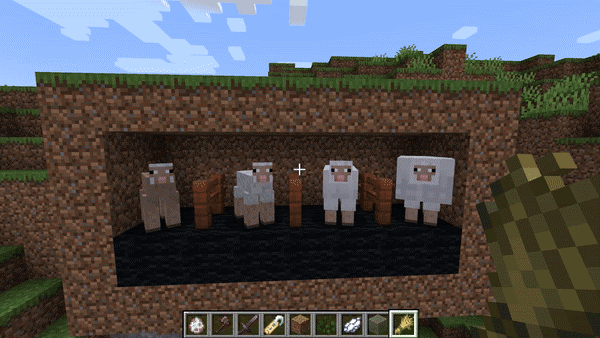

# An Adaptive Landscape: Modeling Evolution in Minecraft
This mod endeavors to bring evolution to the hit game Minecraft, specifically introducing various adaptive characteristics to sheep and trees. This is a fork of the [original page](https://github.com/anyaevostinar/minecraft-sheep-evolution) for the purpose of showcasing my contributions. You can learn more about the sheep-related code, of which I was the principal author, in the [original wiki](https://github.com/anyaevostinar/minecraft-sheep-evolution/wiki/Sheep-Overview) (which is incomplete outside of my pages). We hope that future groups at Carleton will pick up where we left off! What follows is a general summary of my contribution to the project.

Using [mixins](https://github.com/SpongePowered/Mixin/wiki) to target the native SheepEntity, sheep were successfully assigned a "gene" (controlled by WoolType, similar to native DyeColor) which determines wool size at birth, and can be manipulated by simplified models of inheritance and mutation. The modified sheep then take periodic damage if their wool type does not suit the temperature of the environment around them, thus promoting evolution at a highly visible rate (intentionally deviating from scientific realism for obvious reasons). The wool types were distributed across four sheep models; notably, the three lowest-volume sizes employed models that already existed in the game (see below). The "chonky" model, however, is somewhat remarkable in that it was almost certainly the most complex and difficult problem to solve from a standpoint of using mixins rather than having direct access to the Minecraft source code.

The model/render relationship in Minecraft is not particularly intuitive at first glance, though its sensibility grows on you:  essentially, each model layer is registered in EntityModelLayers, then paired with a corresponding model file in a Map object created in EntityModels---a map which the entity's renderer file consults to determine what model to use. To bring our affectionately-imagined model into play without simply editing one of the two existing sheep model layers, I had to contend with the fact that the map produced in EntityModels is rendered immutable before ever leaving the method in which it is created. Whoa! After a weekend of ignoring schoolwork, I eventually managed to pull it off by experimenting with the [largely undocumented mixin feature](https://github.com/SpongePowered/Mixin/wiki/Advanced-Mixin-Usage---Capture-Locals) wherein a local variable can be captured, edited, and returned (see [EntityModelsExt](https://github.com/kenyonnystrom/minecraft-evolution-mod/blob/master/src/main/java/evo/mod/rendering/mixins/EntityModelsExt.java)).

The final big piece of this project that we were able to complete by the deadline was finding a way to intertwine the evolution of sheep and trees respectively. We felt this could be achieved by making tree bark a food source for sheep that would influence their capability to reproduce, likewise affecting the trees' devotion of resources to account for damaged bark. On the sheep end, this meant the creation of a tree pathfinding goal, and our sheep can now be seen finding available bark nearby and going for a munch (eating enough bark/grass is now a requirement for attaining "love mode"). 

I received distinction from the CS department for my contributions to this project. Here is a list of files which were principally or entirely written by me, ordered by conceptual complexity:\
\[[EvolvingSheepEntity](https://github.com/kenyonnystrom/minecraft-evolution-mod/blob/master/src/main/java/evo/mod/sheep/mixins/EvolvingSheepEntity.java), [EntityModelsExt](https://github.com/kenyonnystrom/minecraft-evolution-mod/blob/master/src/main/java/evo/mod/rendering/mixins/EntityModelsExt.java), [EatTreeGoal](https://github.com/kenyonnystrom/minecraft-evolution-mod/blob/master/src/main/java/evo/mod/sheep/EatTreeGoal.java), [SheepWoolRenderer](https://github.com/kenyonnystrom/minecraft-evolution-mod/blob/master/src/main/java/evo/mod/rendering/mixins/SheepWoolRenderer.java), [ModelLayerAccess](https://github.com/kenyonnystrom/minecraft-evolution-mod/blob/master/src/main/java/evo/mod/rendering/mixins/ModelLayerAccess.java), [EvolvingSheepAccess](https://github.com/kenyonnystrom/minecraft-evolution-mod/blob/master/src/main/java/evo/mod/sheep/EvolvingSheepAccess.java), [SheepThickWoolEntityModel](https://github.com/kenyonnystrom/minecraft-evolution-mod/blob/master/src/main/java/evo/mod/rendering/SheepThickWoolEntityModel.java), [WoolType](https://github.com/kenyonnystrom/minecraft-evolution-mod/blob/master/src/main/java/evo/mod/features/WoolType.java), [ChatExt](https://github.com/kenyonnystrom/minecraft-evolution-mod/blob/master/src/main/java/evo/mod/features/ChatExt.java), [EntityModelLayersExt](https://github.com/kenyonnystrom/minecraft-evolution-mod/blob/master/src/main/java/evo/mod/rendering/EntityModelLayersExt.java), [DamageSourceExt](https://github.com/kenyonnystrom/minecraft-evolution-mod/blob/master/src/main/java/evo/mod/features/DamageSourceExt.java)\]\

Lots of credit to advisor Anya Vostinar and all my teammates!
