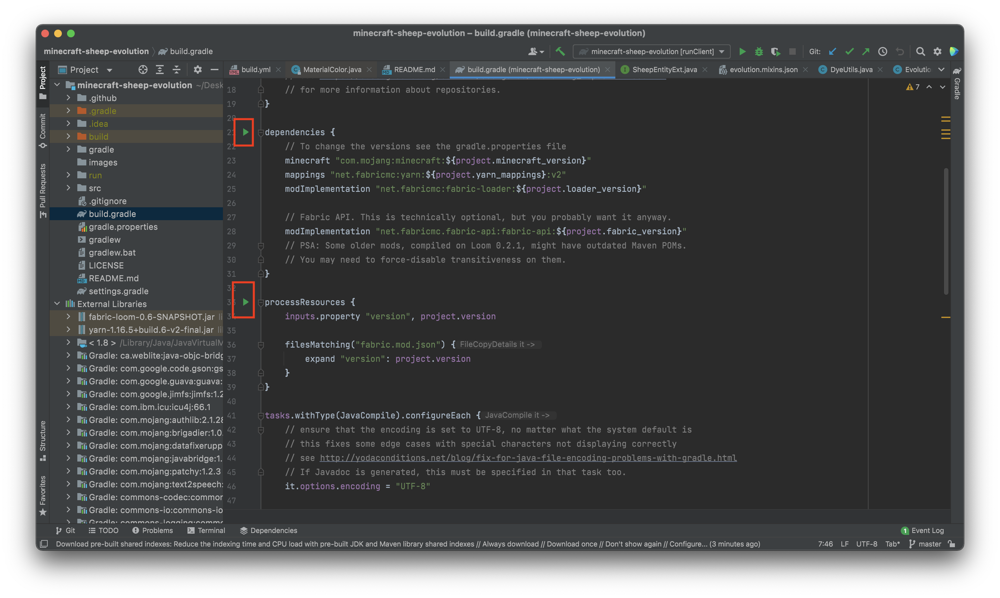
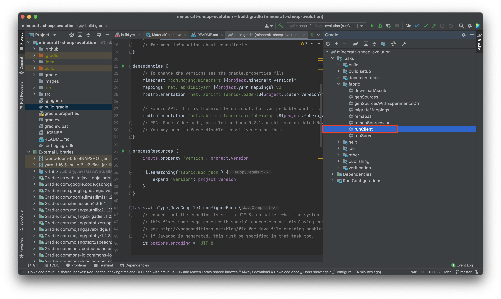

# Evolution Mod
This mod is meant to simulate the natural selection of sheep.
We modified the color, reproduction, life cycle of sheep and the hunting behavior of wolves to simulate the natural selection in Minecraft using Java. 
Please use IntelliJ Idea open it.

You can download IntelliJ Idea using this link: https://www.jetbrains.com/idea/download/#section=mac, or just search Intellij Download on Google.
(community version is enough for this project). Please choose the right operating system (i.e. I'm using macOS m1 chip, then I would choose macOS below the "Download IntelliJ IDEA" and under community, choose .dmg(Apple Silicon) and then click download).

Then, run the build.gradle file.

After that, in the upper right corner, click gradle, and in fabric dropdown menu, click runClient.
 

About Mixin:
This is a supper useful website that introduces how mixin works.
https://fabricmc.net/wiki/tutorial:mixin_introduction

Remarks:

1,Please register your mixin at eliarbogast.evolution.mod.mixins after creating it

Q&A:

Algo:
//change name
